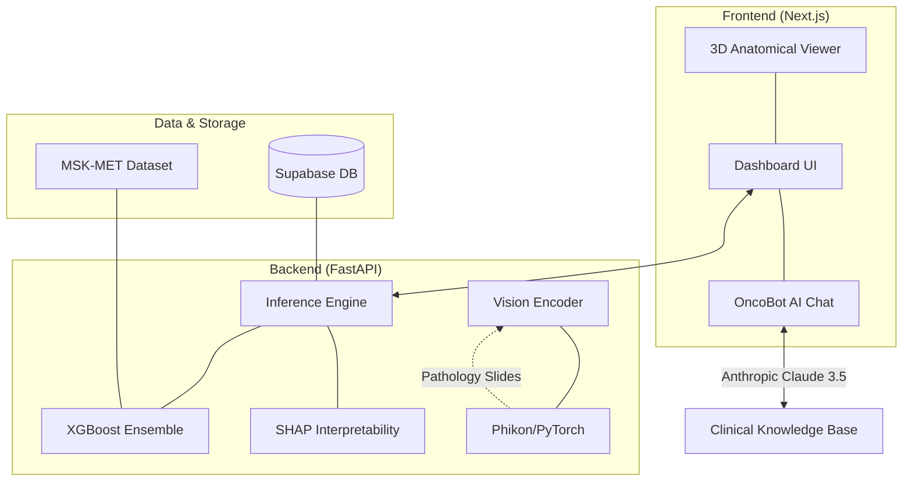

# OncoPath: Multimodal Cancer Metastasis Risk Prediction


<p align="center">
  <strong>Transforming Genomic Complexity into Clinical Insight with 3D Anatomical Visualizations and Multimodal AI.</strong>
</p>

<p align="center">
  
  
  
  
  
</p>

---

## 🔬 Overview

OncoPath is a state-of-the-art AI-driven platform designed to predict organ-specific metastatic risks for cancer patients. By integrating longitudinal clinical data with genomic mutation profiles from the **MSK-MET dataset**, OncoPath provides clinicians and researchers with real-time **"What-If" simulations** to understand how specific genetic mutations (e.g., *TP53*, *KRAS*) influence cancer progression across 21 different anatomical sites.

### 🌟 Key Highlights

- **3D Metastatic HUD (Heads-Up Display):** A high-fidelity, interactive 3D anatomical viewer that visualizes risk intensity as a dynamic heatmap across the human body.
- **Multimodal Fusion Engine:** Integrates clinical tabular data, 101-gene mutation profiles, and high-fidelity pathology imaging signals using specialized Vision Encoders (Phikon).
- **OncoBot Clinical Assistant:** A specialized RAG-based clinical AI assistant restricted to oncological reasoning, providing interpreted insights directly within the dashboard.
- **Genomic Prototyping:** Real-time mutation toggling with a <50ms latency response from the FastAPI-backed XGBoost inference engine.

---

## 🏗️ System Architecture



---

## 🛠️ Tech Stack

### Frontend
- **Framework:** Next.js 14 (App Router)
- **3D Rendering:** Three.js, React Three Fiber, React Three Drei
- **Animations:** Framer Motion
- **Styling:** Tailwind CSS
- **Interactions:** Radix UI components

### Backend & AI
- **API:** FastAPI, Uvicorn
- **Machine Learning:** XGBoost, Scikit-learn
- **Interpretability:** SHAP
- **Vision:** PyTorch, Phikon (Pathology Foundation Model)
- **Database:** Supabase (PostgreSQL)
- **LLM Context:** Anthropic Claude (Haiku & Sonnet)

---

## 📁 Project Structure

```text
.
├── oncopath-next/          # Modern Next.js application (Dashboards & 3D Viewer)
├── scripts/                # Python backend implementation
│   ├── api_service.py       # FastAPI server for real-time inference
│   ├── train_iteration_3.py # Automated ML pipeline
│   └── extract_embeddings.py # Vision encoder for multimodal fusion
├── models/                 # Serialized XGBoost & Vision artifacts
├── iterations/             # Phase-by-phase project documentation
├── data/                   # Genomic (MSK-MET) and clinical datasets
└── README.md
```

---

## 🚀 Getting Started

### Prerequisites

- **Node.js:** v18 or later
- **Python:** v3.9 or later
- **API Keys:** Claude API Key (set in `.env`)

### 1. Backend Setup

```bash
# Install Python dependencies
pip install -r requirements.txt

# Start the Risk Simulator API
python scripts/api_service.py
```

### 2. Frontend Setup

```bash
cd oncopath-next

# Install dependencies
npm install

# Start the development server
npm run dev
```

The dashboard will be live at `http://localhost:3000`.

---

## 📈 Model Performance & Validation

Our models are audited for **"Genomic Lift"**—measuring the performance improvement when adding genetic data to clinical-only baselines.
- **21 Organ Sites:** Specifically optimized models for Brain, Lung, Bone, Liver, etc.
- **Interpretability:** Exact probability reporting and SHAP force plots for transparent reasoning.
- **Validation:** Audited against clinical literature (e.g., verifying KRAS influence on Colorectal metastasis patterns).

---

## 👥 Contributors

| Name | Role |
| :--- | :--- |
| **Jason Seh** | Project Architect & ML Engineer |
| **Mitchell Eickhoff** | Full Stack Developer |
| **Konrád Gózon** | Frontend & 3D Specialist |
| **Rocky Shao** | Business Lead |

---

## ⚖️ License

Distributed under the MIT License. See `LICENSE` for more information.

